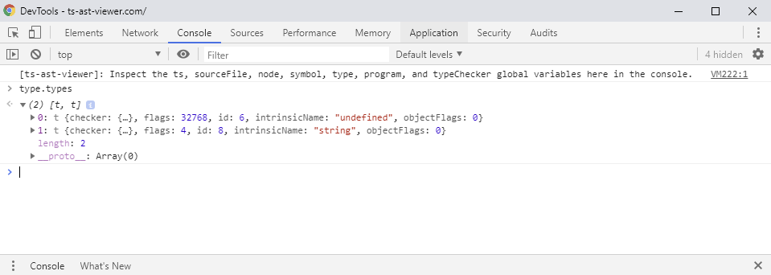

# About

TypeScript AST Viewer provides a way to view the TypeScript AST, symbols, types, and signatures.

## Interacting with Compiler Objects

If you open up the developer console it will provide some compiler objects that can be interacted with:

## Additional Resources

- [TypeScript Architectual Overview](https://github.com/microsoft/TypeScript/wiki/Architectural-Overview)
- [Using the Compiler API](https://github.com/Microsoft/TypeScript/wiki/Using-the-Compiler-API)
